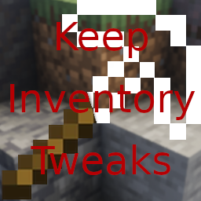

# Keep Inventory Tweaks 

Keep Inventory Tweaks is a Bukkit/Paper plugin for Minecraft that enhances the default `KeepInventory` gamerule. It allows server owners to **fully customize who keeps their inventory** on death, with support for per-player toggles, offline players, and world-global behavior. The plugin is designed to be **safe, flexible, and easy to use**, even with Geyser setups.

---

## Features

- Enable or disable KeepInventory **per player**.  
- Works with **offline players**.  
- Automatic **safe item handling**: players set to not keep inventory will drop items safely at death.  
- Full **tab-completion** for commands and options.  
- Settings and player data stored in **JSON files**, making it easy to backup or modify.  

---

## Commands

### `/keep_player_inventory update <player> <true|false>`
- Toggles the KeepInventory state for a player.  
- Only available to **OPs or users with `keepinventory.update` permission**.  
- Examples: 
```/keep_player_inventory update Notch true``` will ensure Notch does not lose items upon death.


### `/keep_player_inventory check [player]`
- Checks your own KeepInventory state or another player's.  
- Only OPs or users with permission can check other players.  
- If no player is specified, defaults to checking your own state.  
- Examples: 

``` /keep_player_inventory check ``` will return your current keepinventory state.

``` /keep_player_inventory check Notch ``` will return Notch's current keepinventory state.


---

## Installation

### Method 1 - Releases
1. Go to the [Releases](https://github.com/jiuhaywi/KeepInventoryTweaks/releases), and download the latest release.
2. Add the .jar file to your ```/plugins/``` folder on your server.
3. Keep Inventory Tweaks is now installed upon the next run of your server.

### Method 2 - Maven
1. Download and install Maven.
2. Clone or download the project.
3. Go to the location of the project, and open a terminal.
4. Run ```mvn clean package``` to manually compile the project.
5. Cd into ```/target/```, and move the compiled .jar file into your server's ```/plugins/``` folder.
6. Keep Inventory Tweaks is now installed upon the next run of your server.

## Permissions
- ```keepinventory.update``` — Allows toggling KeepInventory for other players.
- OPs automatically have all permissions.

## Configuration & Storage

- Player settings are stored in JSON files in the plugin directory.
- The plugin keeps all data persistent and works with offline players.
- ```World-global``` behavior ensures consistency across all worlds on your server.

## Contributing

Pull requests and issues are welcome! Please ensure code follows the same structure and JSON storage conventions.


## License

Keep Inventory Tweaks is licensed under the MIT License with required attribution.  
You may use or modify this plugin for personal or server use, but **you must credit jiuhaywi** as the original author.
View the license [here](https://github.com/jiuhaywi/KeepInventoryTweaks/blob/main/LICENSE)
